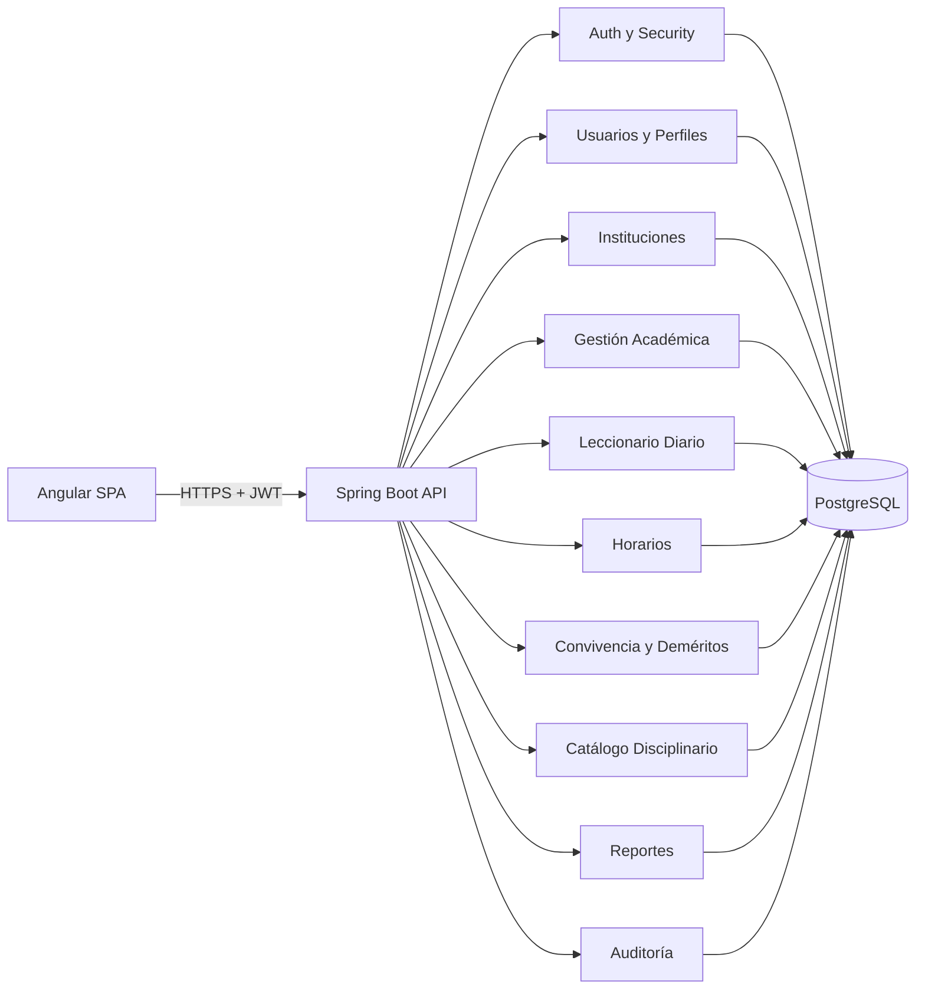

# Arquitectura técnica

## Objetivo

Este documento describe la arquitectura base del proyecto Leccionario y la evolución prevista para digitalizar el leccionario físico institucional, incluyendo control diario de avance académico, asistencia, novedades, firmas y registro disciplinario.

## Estilo arquitectónico

Se adopta un monolito modular para la primera fase institucional. Esta decisión reduce el costo operativo, simplifica el despliegue y facilita la trazabilidad funcional y normativa en una sola base de código, sin bloquear una futura extracción de capacidades a servicios independientes.

## Principios de diseño

- Separación por dominios funcionales.
- Capas internas por módulo para aislar web, lógica y persistencia.
- Contratos externos desacoplados de las entidades JPA mediante DTOs y mappers.
- Seguridad centralizada con autenticación JWT y autorización por endpoint y método.
- Auditoría transversal para registrar acciones relevantes del sistema.
- Evolución incremental: primero una solución operativa y trazable, luego optimización y extracción de componentes si el crecimiento lo exige.

## Vista general

## Estructura backend

El backend está organizado por módulos de dominio dentro del paquete base `com.leccionario.backend`. Cada módulo contiene sus propias capas internas según su responsabilidad.

### Módulos actuales y proyectados

- `auth`: autenticación, emisión de JWT y respuesta de login.
- `security`: filtros JWT, carga de usuarios, configuración de seguridad y autorización.
- `user`: usuarios, perfiles, docentes y estudiantes.
- `institution`: instituciones educativas.
- `academic`: periodos académicos, cursos, asignaturas y relaciones institucionales.
- `schedule`: horarios y bloques de clase por curso, materia y docente.
- `lessonplan`: planificación pedagógica por sesión o registro tradicional.
- `dailylog`: leccionario diario operativo por bloque horario.
- `attendance`: inasistencias y novedades asociadas a la jornada.
- `discipline`: catálogo de acciones contrarias a la convivencia y registro de deméritos.
- `report`: métricas, acumulados y exportaciones.
- `audit`: registro de eventos operativos y trazabilidad.
- `common`: clases base, manejo global de excepciones y utilitarios compartidos.
- `config`: configuración transversal e inicialización de datos semilla.

### Capas internas por módulo

- `web`: controladores REST.
- `service`: reglas de negocio y coordinación de casos de uso.
- `repository`: acceso a datos con Spring Data JPA.
- `domain`: entidades y enumeraciones del dominio.
- `dto`: contratos de entrada y salida de la API.
- `mapper`: transformación entre entidades y DTOs.

## Reglas de dependencia

- `web` solo depende de `service`, `dto` y componentes transversales.
- `service` puede depender de `repository`, `domain`, `dto`, `mapper` y servicios transversales como auditoría o seguridad.
- `repository` depende únicamente de `domain` y de la infraestructura JPA.
- Los módulos funcionales no deben acceder directamente a controladores de otros módulos.
- La comunicación entre módulos debe ocurrir a nivel de servicio o mediante repositorios claramente justificados.
- `common`, `security` y `audit` son módulos transversales; no deben concentrar lógica de negocio que pertenezca a otros dominios.

## Componentes principales

### Autenticación y seguridad

- El acceso al backend se realiza con JWT en modo stateless.
- Las credenciales se validan con Spring Security y `DaoAuthenticationProvider`.
- Las contraseñas se almacenan con BCrypt.
- La autorización se resuelve con reglas por ruta y con `@EnableMethodSecurity`.
- El filtro JWT se ejecuta antes de `UsernamePasswordAuthenticationFilter`.
- Actualmente se permite acceso público a `/api/auth/**` y `/actuator/health`.
- CORS está habilitado de forma amplia para facilitar integración con la SPA; en ambientes productivos debe restringirse por origen.

### Gestión académica

Este bloque concentra catálogos y estructura institucional académica:

- periodos académicos
- cursos
- asignaturas
- relación de estudiantes y docentes con su contexto académico

### Horarios

El módulo `schedule` se incorpora para representar la estructura real del día lectivo:

- bloques horarios con hora de inicio y fin
- tipo de bloque: clase o receso
- horario por curso y paralelo
- asignación de materia y docente por bloque

Este módulo es clave porque permitirá precargar el leccionario diario con la malla horaria real y limitar el registro a los bloques correspondientes.

### Leccionario diario

El módulo `dailylog` será la representación digital del formato físico de control diario de avance. Cada jornada debe asociarse con:

- fecha
- número de día laborado
- curso y paralelo
- ciudad o institución
- entradas por bloque horario
- asignatura
- unidad didáctica
- destrezas con criterio de desempeño
- firma del profesor
- alumnos inasistentes
- observaciones
- cierre de jornada con firmas institucionales

La unidad funcional del leccionario ya no es solo una planificación aislada, sino una jornada completa con varias filas por bloque.

### Asistencia y novedades

El control físico evidencia que la asistencia e inasistencia por bloque es parte del mismo proceso de aula. Por eso se propone un módulo o subdominio `attendance` con:

- inasistencias por estudiante y por bloque
- novedades generales del curso
- novedades específicas por estudiante
- justificación o seguimiento posterior

### Convivencia y deméritos

El registro físico de deméritos revela dos necesidades separadas:

- un catálogo normativo de faltas
- un registro operativo de deméritos por estudiante

Por eso el dominio `discipline` debe dividirse en:

- `BehaviorOffenseCatalog`: catálogo de acciones contrarias a la buena convivencia
- `StudentDemerit`: registro de incidencias por fecha, estudiante y categoría

### Reportes

El módulo `report` debe evolucionar para cubrir:

- avance diario por curso y docente
- inasistencias por bloque o por jornada
- novedades generales y específicas
- deméritos acumulados por estudiante, curso y periodo
- exportaciones institucionales a PDF y Excel

### Auditoría

El módulo `audit` registra acciones relevantes del sistema con usuario, módulo, acción y detalles. Su propósito es apoyar trazabilidad institucional y futura revisión operativa.

## Modelo de datos objetivo

El esquema relacional actual se apoya en PostgreSQL y debe evolucionar alrededor de estas entidades principales:

- `roles`
- `institutions`
- `users`
- `user_roles`
- `academic_periods`
- `courses`
- `subjects`
- `teachers`
- `students`
- `schedule_blocks`
- `course_schedules`
- `daily_logs`
- `daily_log_entries`
- `daily_log_student_absences`
- `daily_log_signatures`
- `behavior_categories`
- `behavior_offenses`
- `student_demerits`
- `lesson_plans`
- `evaluations`
- `logs`

### Relaciones clave

- Un `user` pertenece a una `institution`.
- Un `user` puede tener múltiples `roles`.
- Un `teacher` referencia a un `user`.
- Un `student` referencia a un `user` y pertenece a un `course`.
- Un `course_schedule` referencia a `course`, `subject`, `teacher` y `schedule_block`.
- Un `daily_log` representa la jornada de un curso en una fecha.
- Un `daily_log_entry` representa una fila del leccionario por bloque horario.
- Un `daily_log_student_absence` asocia estudiantes inasistentes a una entrada concreta.
- Un `daily_log_signature` conserva el cierre y validación institucional.
- Un `behavior_offense` pertenece a una categoría y define la ponderación del demérito.
- Un `student_demerit` referencia a `student`, `behavior_offense`, `course` y `academic_period`.

### Consideraciones de modelado

- La separación entre `lesson_plans` y `daily_logs` evita mezclar planificación pedagógica con control operativo de la jornada.
- La asistencia por bloque no debe resolverse con texto libre si queremos reportes confiables.
- El catálogo disciplinario debe centralizar literales, descripción y ponderación; no debe duplicarse por registro.
- Las firmas deben modelarse como confirmaciones trazables del sistema y no solo como imágenes.
- A futuro puede incorporarse firma manuscrita, pero en primera fase basta firma lógica con usuario, rol y timestamp.

## Flujos principales objetivo

### 1. Inicio de sesión

1. La SPA envía credenciales a `POST /api/auth/login`.
2. El backend autentica al usuario con Spring Security.
3. Si las credenciales son válidas, se emite un JWT con identidad, perfiles y permisos.
4. La SPA adjunta el token en las siguientes solicitudes protegidas.

### 2. Construcción del leccionario diario

1. El docente selecciona fecha, curso y paralelo.
2. El backend consulta el horario oficial de ese curso.
3. El sistema construye la jornada con bloques de clase y receso.
4. El docente completa cada fila con tema, unidad didáctica, destreza, inasistencias y observaciones.
5. El registro queda en estado borrador hasta su cierre.

### 3. Cierre y firma de jornada

1. El usuario autorizado confirma que la jornada está completa.
2. El sistema registra firma lógica con usuario, rol y timestamp.
3. Inspector o tutor puede revisar y agregar su validación.
4. El leccionario pasa a estado cerrado o firmado.

### 4. Registro de deméritos

1. El inspector o actor autorizado selecciona estudiante, fecha y categoría.
2. El sistema obliga a elegir una falta desde el catálogo.
3. Se registra la cantidad o ponderación correspondiente.
4. El módulo de reportes consolida acumulados por curso, estudiante y periodo.

### 5. Consulta de reportes

1. La SPA solicita métricas o exportaciones.
2. El módulo `report` agrega información desde leccionario diario, asistencia, disciplina y estructura académica.
3. El backend devuelve datos listos para dashboard o descarga.

## Backend y frontend

La SPA en Angular consume el backend exclusivamente vía REST. La arquitectura frontend debe crecer por dominios funcionales, no por pantallas aisladas.

### Áreas frontend actuales

- `core`: autenticación, guardas, interceptor y servicios transversales.
- `features/auth`
- `features/dashboard`
- `features/lesson-plans`
- `features/reports`
- `features/users`
- `features/academic`
- `features/audit`

### Áreas frontend siguientes

- `features/daily-log`
- `features/schedules`
- `features/discipline/catalog`
- `features/discipline/records`

### Criterios de integración

- El frontend no debe asumir estructura interna de entidades JPA.
- Toda comunicación debe usar DTOs expuestos por la API.
- El token JWT debe gestionarse desde `core`.
- La navegación protegida debe depender de autenticación y permisos.
- El leccionario diario debe poder renderizar una tabla similar al formato físico, pero con validaciones y precarga automática.

## Plan de implementación recomendado

### Fase 1. Horarios institucionales

- crear `schedule_blocks`
- crear `course_schedules`
- permitir administración por curso, materia y docente
- usar estos datos para precargar jornadas

### Fase 2. Leccionario diario

- crear `daily_logs`
- crear `daily_log_entries`
- soportar registro por bloque horario
- incluir observaciones e inasistencias

### Fase 3. Firmas y cierre

- firmas lógicas por docente, tutor e inspector
- estados `BORRADOR`, `CERRADO`, `FIRMADO`
- validaciones de completitud

### Fase 4. Catálogo disciplinario

- crear categorías
- cargar catálogo normativo
- administrar literales, descripciones y ponderaciones

### Fase 5. Registro de deméritos

- registrar incidencias por estudiante
- consolidar totales
- exponer reportes y exportaciones

## Configuración y ambientes

### Base de datos

- Motor actual: PostgreSQL.
- Configuración actual definida en `application.yml`.
- En desarrollo se está usando `spring.jpa.hibernate.ddl-auto=update`.

### Recomendación para evolución

- Mantener `ddl-auto=update` solo en desarrollo local.
- Introducir migraciones versionadas para ambientes compartidos y producción.
- Externalizar credenciales y secreto JWT mediante variables de entorno o archivos por perfil.
- Definir perfiles como mínimo para `dev`, `test` y `prod`.

## Observabilidad y calidad

- Logging habilitado con SLF4J y niveles configurables.
- Manejo global de excepciones centralizado.
- Datos semilla controlados desde configuración.
- Pruebas de backend con Spring Boot Test, H2 y Spring Security Test.

## Decisiones abiertas

- estrategia formal de migraciones de base de datos
- modelo final de firma institucional
- relación entre planificación pedagógica y leccionario diario
- flujo de justificación de inasistencias
- forma de acumulación y prescripción de deméritos
- formato final de exportaciones institucionales

## Posible evolución

Si el crecimiento funcional u operativo lo justifica, los candidatos naturales para extraerse del monolito son:

- `report`, por su carácter agregador y potencial costo de consulta
- `audit`, para desacoplar persistencia de eventos
- `auth`, si se requiere federación, SSO o integración con más sistemas

Mientras tanto, el monolito modular sigue siendo la opción más simple y adecuada para consolidar el dominio, estabilizar la API y completar la primera versión institucional.
